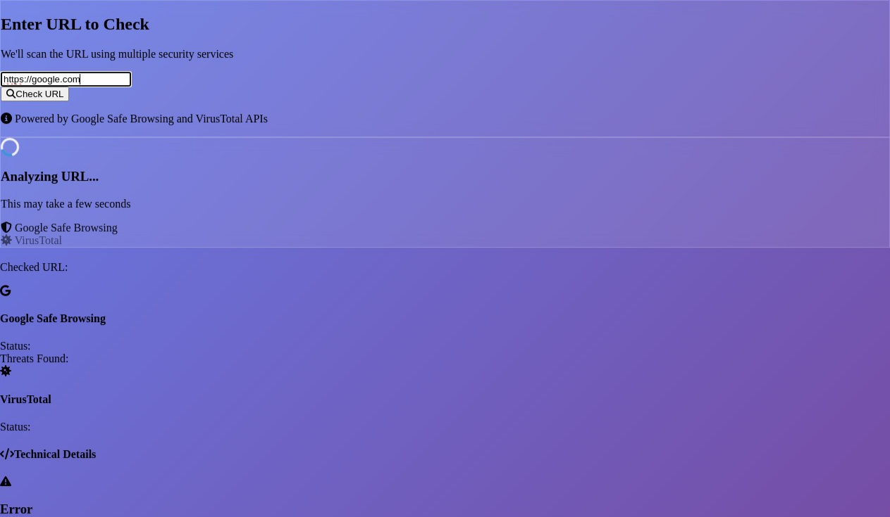

# URL Safety Checker

A professional web application for checking URL safety using Google Safe Browsing and VirusTotal APIs. Built as a comprehensive college project demonstrating modern web development practices, API integration, and security-focused design.



## 🎯 Overview

The URL Safety Checker is a full-stack web application designed to help users identify potentially malicious websites before visiting them. By leveraging two industry-leading security APIs - Google Safe Browsing and VirusTotal - the application provides comprehensive threat analysis and presents results in an intuitive, user-friendly interface.

This project demonstrates proficiency in modern web development technologies, API integration, security best practices, and professional software documentation. It serves as an excellent example of how multiple security services can be combined to create a robust safety tool for everyday internet users.

## ✨ Features

### Core Functionality
- **Multi-Service URL Analysis**: Integrates with both Google Safe Browsing and VirusTotal APIs for comprehensive threat detection
- **Real-time Scanning**: Instant URL analysis with live progress indicators
- **Intelligent Classification**: Smart threat categorization (Safe, Suspicious, Malicious, Unknown)
- **Detailed Reporting**: Comprehensive scan results with technical details
- **URL Validation**: Robust input validation and URL normalization

### User Experience
- **Modern UI Design**: Professional interface built with TailwindCSS
- **Responsive Layout**: Optimized for desktop and mobile devices
- **Interactive Elements**: Smooth animations and hover effects
- **Loading States**: Clear feedback during analysis process
- **Error Handling**: Graceful error messages and recovery options

### Technical Features
- **RESTful API**: Clean, well-documented backend endpoints
- **CORS Support**: Cross-origin resource sharing for frontend-backend communication
- **Logging System**: Comprehensive application logging for debugging
- **Health Monitoring**: Built-in health check endpoints
- **Environment Configuration**: Secure API key management


## 🛠️ Technology Stack

### Backend
- **Flask 2.3.2**: Lightweight Python web framework for API development
- **Flask-CORS 4.0.0**: Cross-Origin Resource Sharing support
- **Requests 2.31.0**: HTTP library for API communications
- **Python-dotenv 1.0.0**: Environment variable management
- **Python 3.11**: Modern Python runtime with enhanced performance

### Frontend
- **HTML5**: Semantic markup with accessibility considerations
- **TailwindCSS 3.3.0**: Utility-first CSS framework for rapid UI development
- **Vanilla JavaScript**: Modern ES6+ features for interactive functionality
- **Font Awesome 6.4.0**: Professional icon library
- **Responsive Design**: Mobile-first approach with flexible layouts

### APIs & Services
- **Google Safe Browsing API v4**: Google's threat detection service
- **VirusTotal API v3**: Comprehensive malware and URL analysis platform

### Development Tools
- **Git**: Version control and collaboration
- **Environment Variables**: Secure configuration management
- **Logging**: Application monitoring and debugging
- **Error Handling**: Robust exception management

## 📋 Prerequisites

Before running this application, ensure you have the following installed:

- **Python 3.8+**: Required for backend functionality
- **pip**: Python package manager
- **Web Browser**: Modern browser with JavaScript support
- **Internet Connection**: Required for API communications

### API Keys Required

You'll need to obtain API keys from the following services:

1. **Google Safe Browsing API**
   - Visit: https://developers.google.com/safe-browsing/v4/get-started
   - Create a Google Cloud project
   - Enable the Safe Browsing API
   - Generate an API key

2. **VirusTotal API**
   - Visit: https://www.virustotal.com/gui/my-apikey
   - Create a free VirusTotal account
   - Generate your personal API key
   - Note: Free tier has rate limits (4 requests/minute)


## 🚀 Installation & Setup

### Step 1: Clone or Download the Project

```bash
# If using Git
git clone <repository-url>
cd url-safety-checker

# Or extract the provided zip file
unzip url-safety-checker.zip
cd url-safety-checker
```

### Step 2: Backend Setup

1. **Navigate to the backend directory:**
   ```bash
   cd backend
   ```

2. **Install Python dependencies:**
   ```bash
   pip install -r requirements.txt
   ```

3. **Configure environment variables:**
   ```bash
   # Copy the example environment file
   cp .env.example .env
   
   # Edit the .env file with your API keys
   nano .env
   ```

4. **Update the .env file with your actual API keys:**
   ```env
   # Google Safe Browsing API Key
   GSB_API_KEY=your_actual_google_safe_browsing_api_key_here
   
   # VirusTotal API Key
   VIRUSTOTAL_API_KEY=your_actual_virustotal_api_key_here
   ```

### Step 3: Start the Application

1. **Start the backend server:**
   ```bash
   # From the backend directory
   python app.py
   ```
   
   The server will start on `http://localhost:5000`

2. **Open the frontend:**
   - Open `frontend/index.html` in your web browser
   - Or serve it through the Flask backend by visiting `http://localhost:5000`

### Step 4: Verify Installation

1. **Check the health endpoint:**
   ```bash
   curl http://localhost:5000/health
   ```
   
   Expected response:
   ```json
   {
     "status": "healthy",
     "timestamp": "2024-01-01T12:00:00.000000",
     "version": "1.0.0"
   }
   ```

2. **Test the frontend interface:**
   - Enter a test URL (e.g., `https://google.com`)
   - Click "Check URL"
   - Verify that results are displayed

## 💻 Usage Guide

### Basic URL Checking

1. **Open the application** in your web browser
2. **Enter a URL** in the input field (protocol optional - will be added automatically)
3. **Click "Check URL"** or press Enter
4. **Review the results** displayed in the interface

### Understanding Results

The application categorizes URLs into four safety levels:

- **🟢 SAFE**: No threats detected by any security service
- **🟡 SUSPICIOUS**: Potential threats detected (1-2 detections)
- **🔴 MALICIOUS**: Multiple threats detected (3+ detections)
- **⚪ UNKNOWN**: Unable to verify due to service errors or insufficient data

### Detailed Analysis

Each scan provides:

- **Overall Safety Status**: Clear verdict with reasoning
- **Google Safe Browsing Results**: Threat types and matches
- **VirusTotal Statistics**: Detection counts from multiple engines
- **Technical Details**: Raw API responses for advanced users


## 🔗 API Documentation

### Base URL
```
http://localhost:5000
```

### Endpoints

#### Health Check
```http
GET /health
```

**Response:**
```json
{
  "status": "healthy",
  "timestamp": "2024-01-01T12:00:00.000000",
  "version": "1.0.0"
}
```

#### URL Safety Check
```http
POST /check
Content-Type: application/json
```

**Request Body:**
```json
{
  "url": "https://example.com"
}
```

**Response:**
```json
{
  "url": "https://example.com",
  "status": "safe",
  "reason": "No threats detected by security services",
  "details": {
    "google_safebrowsing": {
      "matches": []
    },
    "virustotal": {
      "data": {
        "attributes": {
          "stats": {
            "harmless": 75,
            "malicious": 0,
            "suspicious": 0,
            "undetected": 10
          }
        }
      }
    },
    "checked_at": "2024-01-01T12:00:00.000000"
  }
}
```

**Error Response:**
```json
{
  "error": "Invalid URL format",
  "message": "Please provide a valid URL"
}
```

### Status Codes

- `200 OK`: Successful URL check
- `400 Bad Request`: Invalid request format or missing URL
- `500 Internal Server Error`: Server or API service error

## 🏗️ Architecture Overview

### System Architecture

The URL Safety Checker follows a clean separation of concerns with a three-tier architecture:

1. **Presentation Layer (Frontend)**
   - Modern HTML5/CSS3/JavaScript interface
   - TailwindCSS for responsive design
   - Real-time user feedback and animations

2. **Application Layer (Backend)**
   - Flask-based REST API
   - Request validation and processing
   - Result aggregation and classification

3. **Integration Layer (External APIs)**
   - Google Safe Browsing API integration
   - VirusTotal API integration
   - Error handling and retry logic

### Data Flow

```
User Input → Frontend Validation → API Request → Backend Processing → 
External API Calls → Result Aggregation → Response Formatting → 
Frontend Display → User Feedback
```

### Security Considerations

- **API Key Protection**: Environment variables prevent key exposure
- **Input Validation**: Robust URL validation prevents injection attacks
- **CORS Configuration**: Controlled cross-origin access
- **Error Handling**: Secure error messages without sensitive data exposure
- **Rate Limiting**: Respects external API rate limits


## 📁 Project Structure

```
url-safety-checker/
├── backend/                    # Flask backend application
│   ├── services/              # External API integration modules
│   │   ├── safe_browsing.py   # Google Safe Browsing API client
│   │   └── virustotal.py      # VirusTotal API client
│   ├── app.py                 # Main Flask application
│   ├── utils.py               # Utility functions and helpers
│   ├── requirements.txt       # Python dependencies
│   ├── .env.example          # Environment variables template
│   └── .env                  # Environment variables (not in git)
├── frontend/                  # Frontend web interface
│   └── index.html            # Main application interface
├── docs/                     # Documentation and diagrams
│   ├── architecture.png      # System architecture diagram
│   ├── workflow.png          # Application workflow diagram
│   └── presentation.pptx     # Project presentation slides
├── screenshots/              # Application screenshots
│   ├── main-interface.png    # Main application interface
│   ├── results-safe.png      # Safe URL result example
│   ├── results-malicious.png # Malicious URL result example
│   └── mobile-view.png       # Mobile responsive design
├── README.md                 # This comprehensive documentation
└── LICENSE                   # Project license information
```

### File Descriptions

#### Backend Components

- **`app.py`**: Main Flask application with route definitions, error handling, and server configuration
- **`utils.py`**: Utility functions for URL validation, normalization, and result classification
- **`services/safe_browsing.py`**: Google Safe Browsing API integration with error handling and logging
- **`services/virustotal.py`**: VirusTotal API integration with retry logic and rate limiting
- **`requirements.txt`**: Python package dependencies with version specifications

#### Frontend Components

- **`index.html`**: Complete single-page application with modern UI, responsive design, and interactive features

#### Documentation

- **`README.md`**: Comprehensive project documentation (this file)
- **`docs/`**: Additional documentation, diagrams, and presentation materials

## 🔧 Development & Customization

### Adding New Security Services

To integrate additional security APIs:

1. **Create a new service module** in `backend/services/`
2. **Implement the API client** following the existing pattern
3. **Update the classification logic** in `utils.py`
4. **Modify the frontend** to display new service results

Example service structure:
```python
# backend/services/new_service.py
import os
import requests
import logging

logger = logging.getLogger(__name__)

def check_new_service(url):
    """Check URL against New Security Service API"""
    try:
        api_key = os.getenv("NEW_SERVICE_API_KEY")
        # Implementation here
        return result
    except Exception as e:
        logger.error(f"New Service API error: {str(e)}")
        return {"error": "Service unavailable"}
```

### Customizing the UI

The frontend uses TailwindCSS utility classes for styling. Key customization areas:

- **Color Scheme**: Modify gradient and color classes
- **Layout**: Adjust grid and flexbox configurations
- **Animations**: Customize CSS transitions and keyframes
- **Responsive Design**: Modify breakpoint-specific classes

### Environment Configuration

Additional environment variables can be added to `.env`:

```env
# Application Settings
DEBUG_MODE=true
LOG_LEVEL=INFO
MAX_RETRIES=3
REQUEST_TIMEOUT=15

# Feature Flags
ENABLE_CACHING=false
ENABLE_RATE_LIMITING=true
```

## 🧪 Testing

### Manual Testing Checklist

#### Frontend Testing
- [ ] Page loads correctly in multiple browsers
- [ ] Responsive design works on mobile devices
- [ ] Form validation prevents empty submissions
- [ ] Loading states display during API calls
- [ ] Results display correctly for all status types
- [ ] Error messages appear for invalid URLs

#### Backend Testing
- [ ] Health endpoint returns correct response
- [ ] URL validation rejects malformed URLs
- [ ] API integration handles network errors gracefully
- [ ] CORS headers allow frontend access
- [ ] Logging captures important events

#### Integration Testing
- [ ] Frontend successfully communicates with backend
- [ ] API responses are properly formatted
- [ ] Error states are handled correctly
- [ ] Performance is acceptable for typical use cases

### Test URLs

Use these URLs for testing different scenarios:

- **Safe URLs**: `https://google.com`, `https://github.com`
- **Test URLs**: `http://malware.testing.google.test/testing/malware/`
- **Invalid URLs**: `not-a-url`, `ftp://example.com`


## 🔍 Troubleshooting

### Common Issues

#### "API key not configured" Error
**Problem**: Missing or invalid API keys in environment variables.

**Solution**:
1. Verify `.env` file exists in the `backend/` directory
2. Check that API keys are correctly formatted (no extra spaces)
3. Ensure environment variables are loaded by restarting the Flask server

#### "Request timeout" Error
**Problem**: External API services are slow or unresponsive.

**Solution**:
1. Check internet connectivity
2. Verify API service status pages
3. Increase timeout values in service modules if needed

#### Frontend Not Loading
**Problem**: Browser cannot access the HTML file or Flask server.

**Solution**:
1. Ensure Flask server is running on port 5000
2. Check browser console for JavaScript errors
3. Verify CORS configuration allows frontend domain

#### "Port already in use" Error
**Problem**: Another process is using port 5000.

**Solution**:
```bash
# Find process using port 5000
lsof -i :5000

# Kill the process (replace PID with actual process ID)
kill -9 <PID>

# Or use a different port
python app.py --port 5001
```

### Performance Optimization

#### API Response Times
- VirusTotal API can be slow (5-10 seconds) for new URLs
- Google Safe Browsing typically responds in 1-2 seconds
- Consider implementing caching for frequently checked URLs

#### Rate Limiting
- VirusTotal free tier: 4 requests/minute
- Google Safe Browsing: 10,000 requests/day
- Implement user-side rate limiting for production use

## 🚀 Deployment

### Local Development
The application is configured for local development by default. Follow the installation instructions above.

### Production Deployment

#### Option 1: Traditional Server Deployment

1. **Prepare the server environment:**
   ```bash
   # Install Python and pip
   sudo apt update
   sudo apt install python3 python3-pip nginx

   # Install application dependencies
   pip install -r requirements.txt
   ```

2. **Configure environment variables:**
   ```bash
   # Create production .env file
   sudo nano /etc/environment
   
   # Add your API keys
   GSB_API_KEY="your_production_key"
   VIRUSTOTAL_API_KEY="your_production_key"
   ```

3. **Use a production WSGI server:**
   ```bash
   # Install Gunicorn
   pip install gunicorn
   
   # Run with Gunicorn
   gunicorn -w 4 -b 0.0.0.0:5000 app:app
   ```

4. **Configure reverse proxy (Nginx):**
   ```nginx
   server {
       listen 80;
       server_name your-domain.com;
       
       location / {
           proxy_pass http://127.0.0.1:5000;
           proxy_set_header Host $host;
           proxy_set_header X-Real-IP $remote_addr;
       }
   }
   ```

#### Option 2: Docker Deployment

1. **Create Dockerfile:**
   ```dockerfile
   FROM python:3.11-slim
   
   WORKDIR /app
   COPY backend/ .
   COPY frontend/ ./static/
   
   RUN pip install -r requirements.txt
   
   EXPOSE 5000
   CMD ["python", "app.py"]
   ```

2. **Build and run:**
   ```bash
   docker build -t url-safety-checker .
   docker run -p 5000:5000 --env-file .env url-safety-checker
   ```

#### Option 3: Cloud Platform Deployment

The application can be deployed to various cloud platforms:

- **Heroku**: Use the provided Procfile and requirements.txt
- **AWS EC2**: Follow traditional server deployment steps
- **Google Cloud Run**: Use Docker deployment method
- **DigitalOcean App Platform**: Direct GitHub integration

### Security Considerations for Production

1. **Environment Variables**: Use secure secret management
2. **HTTPS**: Enable SSL/TLS encryption
3. **Rate Limiting**: Implement API rate limiting
4. **Input Validation**: Additional server-side validation
5. **Logging**: Comprehensive audit logging
6. **Monitoring**: Application performance monitoring

## 🤝 Contributing

We welcome contributions to improve the URL Safety Checker! Here's how you can help:

### Development Setup

1. **Fork the repository** on GitHub
2. **Clone your fork** locally
3. **Create a feature branch** for your changes
4. **Make your improvements** following the coding standards
5. **Test thoroughly** using the testing checklist
6. **Submit a pull request** with a clear description

### Coding Standards

- **Python**: Follow PEP 8 style guidelines
- **JavaScript**: Use modern ES6+ features
- **HTML/CSS**: Semantic markup and accessible design
- **Documentation**: Update README.md for significant changes

### Areas for Contribution

- **Additional Security APIs**: Integrate more threat detection services
- **Caching System**: Implement Redis or in-memory caching
- **User Interface**: Enhance design and user experience
- **Mobile App**: Create native mobile applications
- **Browser Extension**: Develop browser extension version
- **Performance**: Optimize API response times
- **Testing**: Add automated test suites

### Bug Reports

When reporting bugs, please include:

- **Environment details**: OS, Python version, browser
- **Steps to reproduce**: Clear reproduction instructions
- **Expected behavior**: What should happen
- **Actual behavior**: What actually happens
- **Screenshots**: Visual evidence if applicable

## 📄 License

This project is licensed under the MIT License - see the [LICENSE](LICENSE) file for details.

### MIT License Summary

- **Commercial use**: ✅ Allowed
- **Modification**: ✅ Allowed
- **Distribution**: ✅ Allowed
- **Private use**: ✅ Allowed
- **Liability**: ❌ Not provided
- **Warranty**: ❌ Not provided

## 🙏 Acknowledgments

- **Google Safe Browsing**: For providing comprehensive threat detection APIs
- **VirusTotal**: For offering detailed malware analysis services
- **TailwindCSS**: For the excellent utility-first CSS framework
- **Flask Community**: For the lightweight and flexible web framework
- **Font Awesome**: For the professional icon library

## 📞 Support & Contact

For questions, issues, or suggestions:

- **GitHub Issues**: Use the repository issue tracker
- **Email**: [Your contact email]
- **Documentation**: Refer to this comprehensive README
- **Community**: Join discussions in the repository

---

**Built with ❤️ for educational purposes and web security awareness.**

*This project demonstrates modern web development practices, API integration, and security-focused design principles. It serves as an excellent learning resource for students and developers interested in web security and full-stack development.*

