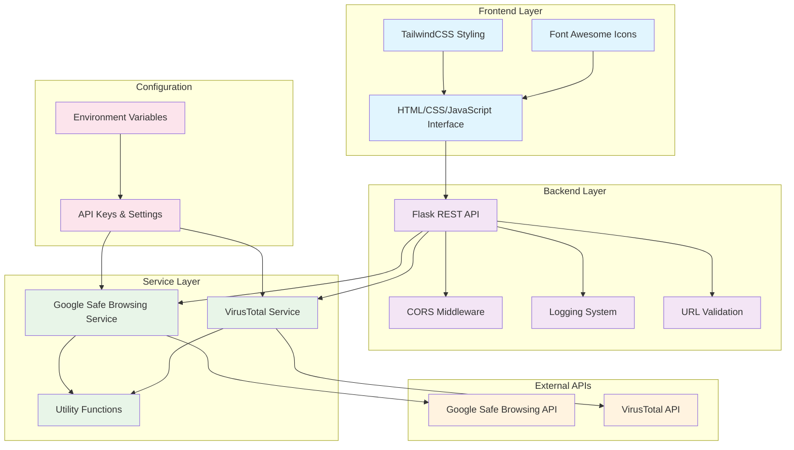

```mermaid
graph TB
    subgraph "Frontend Layer"
        UI[HTML/CSS/JavaScript Interface]
        TW[TailwindCSS Styling]
        FA[Font Awesome Icons]
    end
    
    subgraph "Backend Layer"
        API[Flask REST API]
        CORS[CORS Middleware]
        LOG[Logging System]
        VALID[URL Validation]
    end
    
    subgraph "Service Layer"
        GSB[Google Safe Browsing Service]
        VT[VirusTotal Service]
        UTIL[Utility Functions]
    end
    
    subgraph "External APIs"
        GSBAPI[Google Safe Browsing API]
        VTAPI[VirusTotal API]
    end
    
    subgraph "Configuration"
        ENV[Environment Variables]
        CONFIG[API Keys & Settings]
    end
    
    UI --> API
    TW --> UI
    FA --> UI
    
    API --> CORS
    API --> LOG
    API --> VALID
    API --> GSB
    API --> VT
    
    GSB --> UTIL
    VT --> UTIL
    
    GSB --> GSBAPI
    VT --> VTAPI
    
    ENV --> CONFIG
    CONFIG --> GSB
    CONFIG --> VT
    
    classDef frontend fill:#e1f5fe
    classDef backend fill:#f3e5f5
    classDef service fill:#e8f5e8
    classDef external fill:#fff3e0
    classDef config fill:#fce4ec
    
    class UI,TW,FA frontend
    class API,CORS,LOG,VALID backend
    class GSB,VT,UTIL service
    class GSBAPI,VTAPI external
    class ENV,CONFIG config
```

