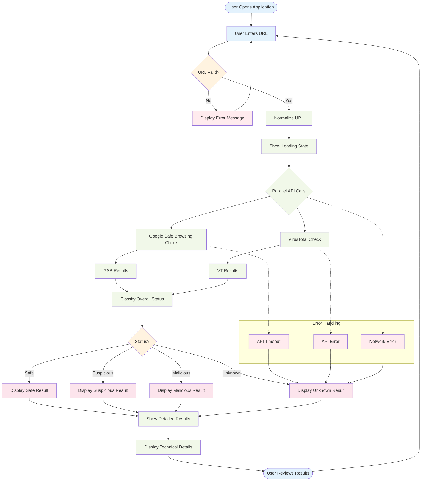

```mermaid
flowchart TD
    START([User Opens Application]) --> INPUT[User Enters URL]
    INPUT --> VALIDATE{URL Valid?}
    
    VALIDATE -->|No| ERROR[Display Error Message]
    ERROR --> INPUT
    
    VALIDATE -->|Yes| NORMALIZE[Normalize URL]
    NORMALIZE --> LOADING[Show Loading State]
    LOADING --> PARALLEL{Parallel API Calls}
    
    PARALLEL --> GSB[Google Safe Browsing Check]
    PARALLEL --> VT[VirusTotal Check]
    
    GSB --> GSBRES[GSB Results]
    VT --> VTRES[VT Results]
    
    GSBRES --> CLASSIFY[Classify Overall Status]
    VTRES --> CLASSIFY
    
    CLASSIFY --> SAFE{Status?}
    
    SAFE -->|Safe| DISPLAYSAFE[Display Safe Result]
    SAFE -->|Suspicious| DISPLAYSUS[Display Suspicious Result]
    SAFE -->|Malicious| DISPLAYMAL[Display Malicious Result]
    SAFE -->|Unknown| DISPLAYUNK[Display Unknown Result]
    
    DISPLAYSAFE --> DETAILS[Show Detailed Results]
    DISPLAYSUS --> DETAILS
    DISPLAYMAL --> DETAILS
    DISPLAYUNK --> DETAILS
    
    DETAILS --> TECHNICAL[Display Technical Details]
    TECHNICAL --> END([User Reviews Results])
    
    END --> INPUT
    
    subgraph "Error Handling"
        TIMEOUT[API Timeout]
        APIERROR[API Error]
        NETWORKERROR[Network Error]
    end
    
    GSB -.-> TIMEOUT
    VT -.-> APIERROR
    PARALLEL -.-> NETWORKERROR
    
    TIMEOUT --> DISPLAYUNK
    APIERROR --> DISPLAYUNK
    NETWORKERROR --> DISPLAYUNK
    
    classDef userAction fill:#e3f2fd
    classDef process fill:#f1f8e9
    classDef decision fill:#fff3e0
    classDef result fill:#fce4ec
    classDef error fill:#ffebee
    
    class START,INPUT,END userAction
    class NORMALIZE,LOADING,PARALLEL,GSB,VT,GSBRES,VTRES,CLASSIFY,DETAILS,TECHNICAL process
    class VALIDATE,SAFE decision
    class DISPLAYSAFE,DISPLAYSUS,DISPLAYMAL,DISPLAYUNK result
    class ERROR,TIMEOUT,APIERROR,NETWORKERROR error
```

